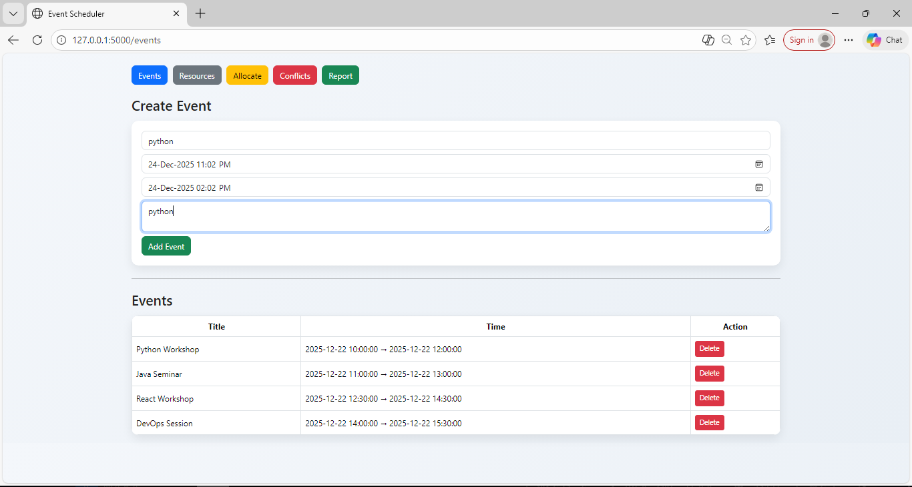
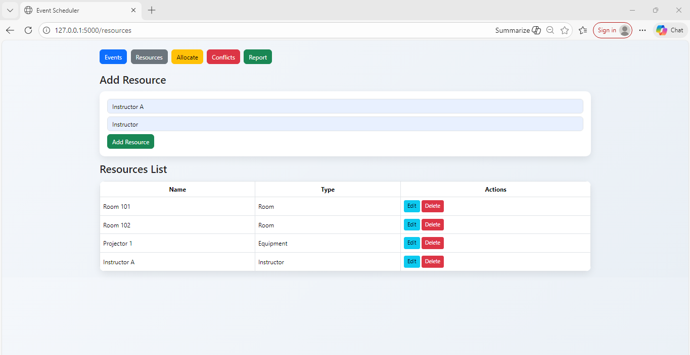
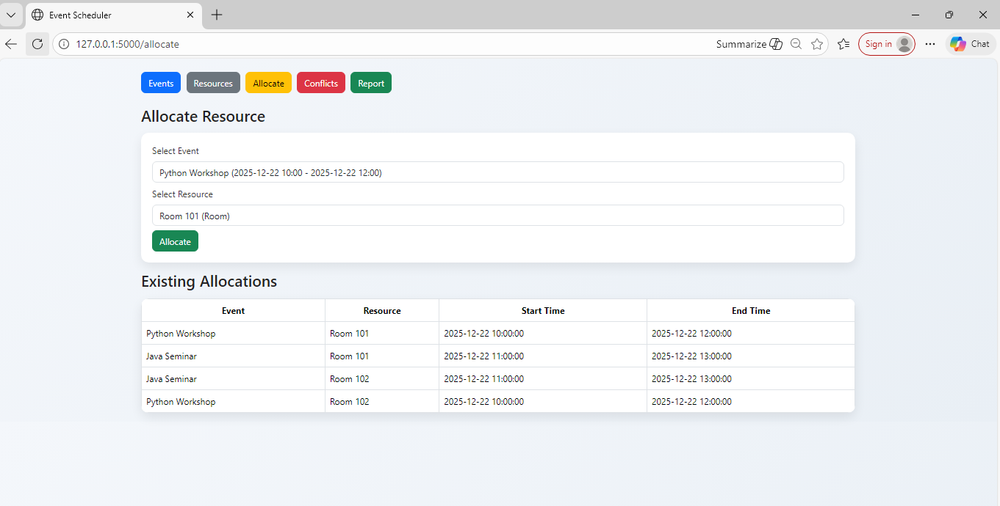
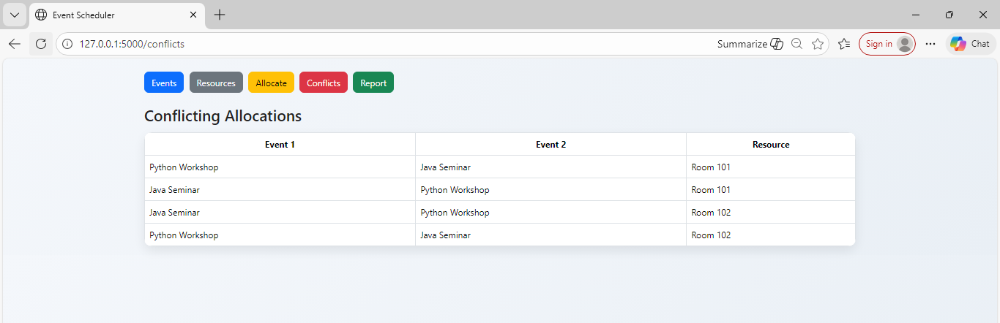
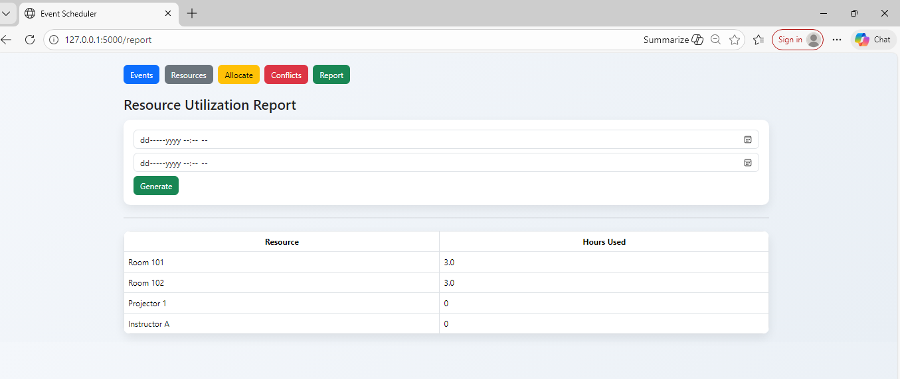

#  Event Scheduling & Resource Allocation System

A web-based application developed using **Flask** that allows organizations to schedule events, manage shared resources, allocate them efficiently, detect conflicts, and generate resource utilization reports.

---

## ✨ Features

- Create, view, and delete events  
- Add, edit, and delete resources  
- Allocate resources to events  
- Automatic conflict detection for overlapping events  
- Clear conflict display page  
- Resource utilization report based on date range  
- Clean and responsive Bootstrap UI  

---

## 🛠️ Tech Stack

- **Backend:** Python (Flask)
- **Database:** SQLite
- **ORM:** SQLAlchemy
- **Frontend:** HTML, CSS, Bootstrap
- **Tools:** VS Code, GitHub

---

## 🧠 Conflict Detection Logic

A conflict occurs when the same resource is assigned to two events whose time intervals overlap.

This logic handles:
- Partial overlaps
- Fully nested events
- Edge-case time boundaries

---

##Steps to run the project 


Step 1: Clone the Repository
```bash
git clone https://github.com/kanishka22it21/Event-Scheduling-Resource-Allocation-System.git
cd Event_Scheduling_Resource_Allocation_System
```

Step 2: Create Virtual Environment
```bash
python -m venv venv
venv\Scripts\activate
```

Step 3: Install Required Dependencies
```bash
pip install -r requirements.txt
```

Step 4: Run the Application
```bash
python app.py
```

Step 5: Open in Browser
```bash
http://127.0.0.1:5000
```

### Events Page


### Resources Page


### Allocation Page


### Conflicts Page


### Report Page


### Video
▶️ [Click here to watch the video](screenshot/video.mp4)


